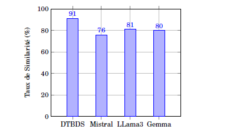

# DTBDS Model - Dynamic Template-Based Dashboard Summarization

## Introduction
Le modèle DTBDS (Dynamic Template-Based Dashboard Summarization) utilise des modèles dynamiques pour automatiser la synthèse des tableaux de bord en utilisant l'intelligence artificielle. Il vise à structurer les données de manière cohérente et lisible, remplissant des sections prédéfinies d'un modèle général avec des informations pertinentes issues des données.

## Méthodologie DTBDS
La méthodologie DTBDS repose sur quatre étapes principales :

1. **Détermination du Contenu** :
    - Collecte des données pertinentes.
    - Sélection des informations clés.
    - Personnalisation du contenu selon les besoins de l'utilisateur.

2. **Planification de la Phrase** :
    - Structuration du modèle avec des sections spécifiques.
    - Ordonnancement logique des phrases.
    - Agrégation des informations similaires.

3. **Microplanification** :
    - Choix des mots appropriés (lexicalisation).
    - Génération de références cohérentes.
    - Agrégation de phrases courtes pour améliorer la lisibilité.

4. **Réalisation Linguistique** :
    - Application de la grammaire correcte.
    - Utilisation appropriée des prépositions et des temps verbaux.
    - Ponctuation correcte pour assurer la clarté et la lisibilité du texte.

## Résultats Comparatifs
Le modèle DTBDS a été comparé avec d'autres modèles (Mistral, LLama3, Gamma) et a montré une précision supérieure :

- **DTBDS** : 93% de précision
- **Mistral** : 76% de précision
- **LLama3** : 81% de précision
- **Gamma** : 80% de précision

## Illustration des Résultats



Cette image illustre les résultats finaux obtenus par FRAG et les modèles comparatifs, mettant en évidence la performance supérieure de DTBDS.


## Installation et Utilisation

1. **Installer les dépendances** :
    ```sh
    pip install simplenlg
    ```

2. **Télécharger les données** et les placer dans le dossier `/drive/`.

3. **Exécuter le notebook** `DTBDS_Model.ipynb` pour générer les résumés des tableaux de bord.

## Exemples de Génération Linguistique
Le code fourni dans le notebook montre également divers exemples de génération linguistique avec SimpleNLG, incluant la génération de phrases au passé, futur, négation, questions, et phrases complexes.

## Conclusion
La méthodologie DTBDS offre une solution efficace pour automatiser la synthèse des tableaux de bord, surpassant d'autres modèles concurrents en termes de précision. Elle permet de générer des résumés cohérents et lisibles, facilitant ainsi la prise de décision basée sur les donnée immobilieres.
